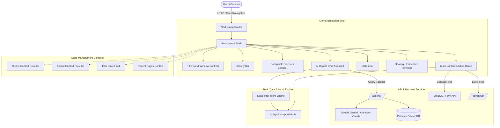

# System Architecture & Technical Specifications

This document details the architectural blueprints, technical stack, state management, and data flow of the **Sajid Islam Interactive VS Code Portfolio**.

---

## 1. High-Level Architecture Diagram



---

## 2. Technology Stack & Decision Rationale

| Layer | Technology | Rationale |
| :--- | :--- | :--- |
| **Framework** | Next.js 16 (App Router) | High-performance server rendering, fast page transitions, zero-config route handling. |
| **Language** | TypeScript 5 | End-to-end type safety, reliable refactoring, IDE autocomplete for structured portfolio datasets. |
| **UI Styling** | Tailwind CSS 3.4 & CSS Variables | Utility-first architecture with centralized CSS variables for dynamic VS Code theme switching. |
| **Motion & Animation** | Framer Motion 11 | Hardware-accelerated fluid spring animations for timeline transitions, modals, and tab switches. |
| **Icons** | Lucide React & React Icons | Comprehensive, lightweight SVG icons perfectly matching standard VS Code activity and file icons. |
| **AI Integration** | Vercel AI SDK, Google Gemini, Pinecone | Multi-model fallback architecture combining local deterministic intelligence with vector embeddings. |
| **State Persistence** | React Context & LocalStorage | Retains user preferences (selected theme, custom accent color, pinned tabs, terminal history) across sessions. |

---

## 3. Directory & Component Breakdown

```text
src/
├── app/
│   ├── layout.tsx                  # Wraps entire app in Context Providers + VS Code Frame
│   ├── page.tsx                    # Landing / Welcome file view
│   ├── experience/page.tsx         # Career milestones & Co-founder timeline
│   ├── projects/
│   │   ├── page.tsx                # Grid of projects filtered by category
│   │   └── [id]/page.tsx           # Dynamic case study route with Git Diff & logs
│   ├── skills/page.tsx             # Skill matrices with category badges
│   ├── education/page.tsx          # Degrees, publications, and institutions
│   ├── contact/page.tsx            # Contact form and direct communication channels
│   ├── settings.json/page.tsx      # Interactive settings.json theme editor
│   ├── data/
│   │   └── portfolio.ts            # Canonical data definitions (experiences, projects, skills, siteMeta)
│   ├── components/vscode/
│   │   ├── ActivityBar.tsx         # Left vertical icon bar
│   │   ├── Sidebar.tsx             # Explorer, Search, Source Control, and Settings panels
│   │   ├── TitleBar.tsx            # Window header with breadcrumbs and search trigger
│   │   ├── Tabs.tsx                # Editor tabs with close, pin, and active styling
│   │   ├── Breadcrumbs.tsx         # Path hierarchy indicator (e.g., sajid > experience > timeline.go)
│   │   ├── Terminal.tsx            # Full interactive terminal emulator
│   │   ├── CommandPalette.tsx      # Quick command & file navigator (Ctrl+P)
│   │   ├── AIChat.tsx              # Copilot AI chat sidebar panel
│   │   └── StatusBar.tsx           # Bottom system diagnostics bar
│   └── lib/
│       ├── intelEngine.ts          # Deterministic local AI fallback matcher
│       ├── search.ts               # Fuzzy search engine for files & case studies
│       ├── useOpenTabs.ts          # Reactive tab lifecycle hook
│       └── themeContext.tsx        # Dynamic theme engine
```

---

## 4. Data Flow & Tab Lifecycle

1. **Route Navigation**:
   - When a user clicks a file in Explorer or Command Palette, `useOpenTabs` intercepts the path.
   - If the tab exists in the active tab set, it is focused.
   - If it is new, a dynamic extension (`.tsx`, `.py`, `.json`, `.sql`) is computed and appended to the open tabs array.
   - Active tab state synchronizes with `localStorage` for tab persistence.

2. **AI Copilot & Intel Engine**:
   - Query submitted by user in `AIChat.tsx`.
   - Step 1: Query passed to `getLocalIntel(query)` in `intelEngine.ts`.
   - Step 2: If intent matches known portfolio entities (CybrCraft, Deen Commerce, ML stack, Contact), structured data is returned immediately (<10ms).
   - Step 3: If intent is ambiguous or exploratory, query is routed to `/api/chat` for vector retrieval and LLM response streaming.

---

## 5. Security & Build Integrity

- **Environment Isolation**: API keys (`GOOGLE_GENERATIVE_AI_API_KEY`, `PINECONE_API_KEY`, `ANTHROPIC_API_KEY`) are kept strictly server-side in API route handlers.
- **Client Sanitization**: All user inputs in Terminal and Search are sanitized to prevent XSS.
- **Build Verification**: Strict TypeScript type checking (`tsc --noEmit`) and ESLint validation run prior to deployment.
